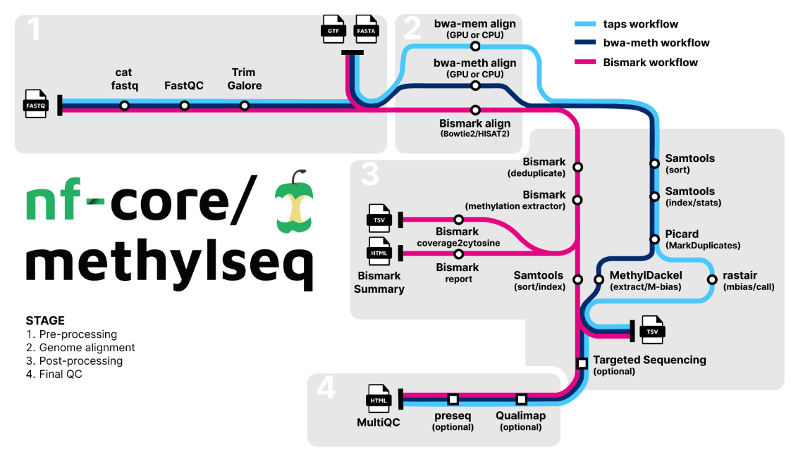

```{r setup, include=FALSE}
knitr::opts_chunk$set(echo = TRUE)
```

# Pacific Ocean Perch Epigenetic Aging

## Pop Gen Background

NOAA Website Info:

Structure: POP have four genetic types that are present in different proportions across their range. The samples used here also have lcWGS data.

Habitat: Generally found hear structured habitats that include rocky outcrops, boulder fields, and deep-water sponges and corals.

Age Structure: Slow-growing & low mortality, reach maturity at \~10 years, and have a maximum age of 98 years.

Love et al 2002:

-   Distribution: Japan, Bering Sea, Aleutian Islands, down to cenral Baja, but common from NorCal to northern Kuril Islands, abundant in GOA (3/4 of all rockfish biomass!)

-   Habitat: juveniles live in shallow (37m) waters and move deeper with age (adults \~90m-825m), and live in the \~200ms in the summer and \>300m in winter.

-   Vivoparous –\> insemination in early fall, fertilized in late fall, larvae release from Jan to July, juveniles might not be seen until 1.5yr

-   Age: live up at at least 100 yrs

    -   90% max size reached at \~20 yrs

    -   Faster growth is inversely related to lifespan

    -   size at maturity varies with latitude

-   Fishery: declined to 2-5% of peak catch from the 60s to the 70s (peak catch in GOA \~300k tons/yr, BC \~ 60k)

    -   Mostly caught in bottom trawl

    -   Recent (as of 2002) catches were at \< 5k tons/yr in GOA & BC, and were depressed in PNW

    -   Expect that some of their habitat has been taken over by other rockfishes and pollock, and therefore recovery is not as feasible

Palof et al 2010:

-   identified a genetic break east and west of Yakutat

Maselko et al 2020:

-   Identified 4 genetic groups of POP across Alaska and BC with spatial overlap

Diana Baetscher & Laura Timm's work: [Google slides](https://docs.google.com/presentation/d/1q9sZIl47SLCCVoj1zYx-AqXXnpYGJJqEnLNOL_0fCss/edit?slide=id.g288472996d2_2_0#slide=id.g288472996d2_2_0)

-   Four genetic groups remain in PCAs

-   Potentially 4 subgroups in the most divergent group (group B)

-   Mixing zone in the central GOA

    -   group C is largely in central GOA

    -   group A is mostly wGOA, bering, Aleutians

    -   group B is mostly aleutians and west/central GOA

    -   Interesting, each specific haul was primarily made of 1 genetic group

    -   Suspected hybridization between groups A and D (potentially microgeographic separation or habitat segregation?)

-   Preliminary morphological analyses suggest smaller eyes are associated with group D

Conversation with Owens Lab at UVic:

-   Kinga

## EM-Seq

[NEBNext Enzymatic Methyl-seq](https://www.neb.com/-/media/nebus/files/manuals/manuale7120.pdf?rev=d97cde7c2d1f448f83efb3e1e4284327&hash=A5C0A358793225CBF106A4897EFD0FD8) Info

Sequenced at SeqMatic

48 samples were paired-end sequenced.

```{r, warning=F, message=F}
library(tidyverse)
library(readxl)
library(readr)

ablgs <- read_delim("metadata_files/fastq_md5.txt",delim = "  ", col_names = F,
                    show_col_types = F) %>%
  select(X2) %>%
  mutate(X2 = gsub('fastq/','',X2),
         ABLG = sub('_.*$','',X2) %>% as.numeric()) %>%
  distinct(ABLG)
nrow(ablgs)
```

There are multiple fastqs for each forward and reverse, so they will need to be concatenated.

Greg Owens uses the [methylseq pipeline](https://nf-co.re/methylseq/4.2.0), shown below, which uses the nextflow workflow management, but I believe that nf-core is a simplification of original nextflow.

[](https://nf-co.re/methylseq/4.2.0)

Diana shared the POP genome with Sai at SeqMatic, and they are working through Bismark.

What reference genome are we using?

Ragtag POP genome from Nicolas Lou: `SebastesalutusPOP6.ragtag.scaffold.fasta`

Kinga aligned to each species genome and all to boccacio

### Metadata

```{r}
metadata <- read_csv("csv_outputs/POP_samples_for_seqmatic_20260420.csv", col_names = T, show_col_types = F)

# this will just confirm that the fastq names match that of the selected metadata 
metadata <- inner_join(metadata, ablgs)

nrow(metadata)
# perfect, matches # of expected samples
```

We have the haul data with sex and weight/length. I don't think haul data actually helps

```{r}
### Call in datasheets 

# --- old
# hauldata <- read_csv("../data/POP_epigenetic_metadata/POP_metadata_Haul_Info.csv", col_names = T, show_col_types = F)

# From Charles & Diana - see metadata.Rmd 
selected_samples <- read_csv("csv_outputs/POP_samples_for_seqmatic_20260420.csv", show_col_types=F)
# this has the sex data
other_samples <- read_csv("csv_outputs/POP_selected_epigenetic_samples_20250414.csv", show_col_types=F)

# Plate map info (SpecimenID & ABLG)
# gel <- read_xlsx("../data/DNA0204_Plate_Map_POP_20250415.xlsx", sheet="gel_scoring")
plate <- read_xlsx("../data/DNA0204_Plate_Map_POP_20250415.xlsx", sheet="Samples for plate map (linked)")
colnames(plate) <- c('ExtractionWell','SPECIMENID','ABLG','Species')

exports <- read_xlsx("../data/POP_epigenetic_metadata/ABLG_exports_POP.xlsx") %>%
  select(ABLG, AlternateID, CollectionYear, CruiseID, HaulID,
         DepthM, `LengthMM`, WeightG) %>%
  mutate(across(all_of(c('AlternateID','CollectionYear','HaulID','CruiseID')), as.numeric))

  exports[exports == "---"] <- NA # convert dashes to NA

# Let's merge all the relevant sheets so we can get ABLG, Age, and Sex all in one sheet
samplemeta <- selected_samples %>%
  left_join(., plate, by = c('ExtractionWell','ABLG')) %>%
  left_join(., other_samples, c='SPECIMENID') %>%
  left_join(., exports, c='ABLG') %>%
  mutate(Sex = case_when(SEX==1 ~ "male", SEX==2 ~ "female", TRUE ~ NA_character_))

samplemeta %>%
  select(ABLG, SPECIMENID, AgeYRS, Sex, LENGTH, WEIGHT, everything()) %>%
  write_tsv(., "csv_outputs/POP_epigenetic_samples_metadata_AgeSex_20260729.tsv")
```

```{r age-distributions}
ggplot()+
  geom_histogram(data=samplemeta, aes(x=AgeYRS,fill=Sex), binwidth=1) +
  ggtitle(paste("Avg Age =",round(mean(metadata$AgeYRS),digits=1),"yrs"))+
  theme_bw() +
  theme(legend.position = c(0.9,0.8))

samplemeta %>% 
  count(Sex)
```

Some notes from our meeting on 06/03/2026

-   Consider the value of just POP epigenetic clock vs. across many rockfish species

    -   Depending on Greg Owens progress and data sharing, could we create a clock that we can validate across the other three species included in their study (bocaccio, yelloweye, blackspotted)

    -   Should we incorporate northern rockfish in sooner or later (e.g. before or after panel development)?

METHYLSEQ

Let's get it set up on sedna head node

```{bash headnode, eval=F}
mamba activate singularity-3.8.6
mamba activate --stack nextflow-24.04.4
```

Set up the input sample sheet in this format:

```         
sample,fastq_1,fastq_2
```

Each sample is on two lanes, so I need to concatenate them.

```{bash, eval=F}
cd /scratch2/nhowe/epi-pop/scripts

ls ../fastq/*R1*gz | cut -d"_" -f1 | uniq > pop-epi-samplenames.txt

mkdir /scratch2/nhowe/epi-pop/fastq/concat
```

```{bash sample-sheet-creation, eval=F}
cd /scratch2/nhowe/epi-pop/fastq/concat

ls $PWD/*R1*gz > tmp_R1.txt
ls $PWD/*R2*gz > tmp_R2.txt
paste -d, ../scripts/pop-epi-samplenames.txt tmp_R1.txt tmp_R2.txt > ../pop-epigenetics-samplesheet.csv
rm tmp*txt

# the sample names MUST be a string
sed -i 's/^/ABLG/d' ../pop-epigenetics-samplesheet.csv
# now add the header line
sed -i '1i sample,fastq_1,fastq_2' ../pop-epigenetics-samplesheet.csv
```

default parameters

Full list of parameters: <https://nf-co.re/methylseq/4.2.0/parameters/>

this pipeline indexes the genome

Run in `/scratch2/nhowe/epi-pop/scripts/methylseq_test.sh`

```{bash, eval=F}
# test on 2 samples
head -n 3 pop-epigenetics-samplesheet.csv > pop-epigenetics-samplesheet_TEST.csv

# this is part of the slurm script
nextflow run nf-core/methylseq \
  --em_seq \
  --input /scratch2/nhowe/epi-pop/pop-epigenetics-samplesheet_TEST.csv \
  --outdir /scratch2/nhowe/epi-pop/methylseq \
  --fasta ~/reference_genomes/sebastes_alutus/SebastesalutusPOP6.ragtag.scaffold.fasta \
  --aligner bismark \
  -profile test,singularity # change to singularity after testing?
```

I kept getting errors after the first run timed out.... Try this instead: <https://github.com/nf-core/configs>

downloading locally to prevent it trying to connect did not work... I think there was an issue with the hidden nextflow files stored in home/nhowe.

It seems I shouldn't delete those in general, but I did this time and reran, and there was some success after also including a custom config... which I have in the scripts folder

```{bash, eval=F}
cd /scratch2/nhowe/epi-pop/scripts

# note that /scratch2/nhowe/epi-pop/methylseq exists

mamba activate singularity-3.8.6
mamba activate --stack nextflow-25.10.4

# then in the head node, I run
nextflow run nf-core/methylseq -profile singularity -c custom.config --input ../pop-epigenetics-samplesheet_TEST.csv --output ../methylseq

# should add singularity cache location to CONFIG FILE --> this created an ERROR!
# created 20260723.config with this and a couple other changes for when I run it on more samples
```

Thoughts:

-   Should I get the polymorphic files from the previous POP work and make sure the CpG sites are not polymorphic?

Full run? started at end of day 7/23/2026

```{bash, eval=F}
cd /scratch2/nhowe/epi-pop/methylseq_fulldataset

nextflow run nf-core/methylseq -profile singularity -c 20260723.config --input ../pop-epigenetics-samplesheet.csv --outdir ./results
```

Dang! I didn't see the note to not use the config file for parameters... this run was cancelled due to lack of space. So i think I'll just have to start from scratch again.

```{bash, eval=F}
cd /scratch2/nhowe/epi-pop/methylseq2

# add yaml with parameters, or just try to run it within the command line?
# --fasta mostly

nextflow run nf-core/methylseq -profile singularity -c 20260724.config --input ../pop-epigenetics-samplesheet.csv --outdir ./results
```

## Use produced Bam files - Seqmatic

Diana asked if the Bismark bams had unmapped reads. I can check that myself with:

```{bash, eval=F}
samtools view -c -f 4 input.bam
```


### Step1: Prepare genome

```{bash in-srun1, eval=F}
module load aligners/bowtie2/2.5.4 bio/bismark/0.24.0

bismark_genome_preparation ~/reference_genomes/sebastes_alutus/
```

### Step 2. Deduplicate

```{bash bismarkBAM_dedup.sh, eval=F}
#SBATCH --job-name=methyldedup
#SBATCH --cpus-per-task=4
#SBATCH --output=/scratch2/nhowe/epi-pop/fromBAMs/job_outfiles/bismark_dedup_%A-%a.out
#SBATCH --mail-type=FAIL,END
#SBATCH --partition=medmem,standard
#SBATCH --mail-user=natasha.howe@noaa.gov
#SBATCH --time=3-00:00:00
#SBATCH --array=27-48%12 # 48 bams

module purge
module load bio/bismark/0.24.0

PROJDIR="/scratch2/nhowe/epi-pop/fromBAMs"
REFGENOMEFOLDER="/home/nhowe/reference_genomes/sebastes_alutus/"
BAMSFILE=${PROJDIR}/scripts/epi-pop_seqmaticBAMs.txt

mkdir -p ${PROJDIR}/dedup

# Extract the BAM path matching SLURM_ARRAY_TASK_ID directly from column 1
bam=$(awk -F':' -v id="${SLURM_ARRAY_TASK_ID}" '$1 == id {print $2}' "${BAMSFILE}")
sortedbam=$(basename "${bam%.*}")"_sorted"

echo "-- Sort ${bam} ----------------------------------"
samtools sort -@ 4 -n ${bam} -o ${PROJDIR}/dedup/${sortedbam}.bam
echo "--- Sorted bam produced: ${PROJDIR}/dedup/${sortedbam}.bam"

echo "-- Start dedup for ${sortedbam}.bam ---------------------"
deduplicate_bismark --paired \
  ${PROJDIR}/dedup/${sortedbam}.bam \
  --output_dir ${PROJDIR}/dedup

echo "--- Dedup done for ${sortedbam}.bam"

if [ -f "${PROJDIR}/dedup/${sortedbam}.deduplicated.bam"]; then
  echo "--Remove sorted bam intermediate file --"
  rm ${PROJDIR}/dedup/${sortedbam}.bam
fi
```

Then I need to move then to share to make space and then I can rename the bamfile with

```{bash, eval=F}
sed 's!.bam!_sorted.deduplicated.bam!g' epi-pop_seqmaticBAMs.txt > epi-pop_sort_dedup_bams_input.txt
```

#### Calculate conversion efficiency
This is without the spike-in!
Supposedly EM-sequencing spike in is either (or both?) unmethylated Lambda DNA and CpG-methylated pUC19 DNA.
I searched in the bam files for lambda and pUC19, but it doesn't seem like seqmatic added that to the ref genome.
So that means I should probably do that myself.

Now I can calculate the conversion efficiency with the deduplicated results.

First create a function to pull from the wordy splitting files
```{r}
# function that takes values from appropriate rows in dedup splitting report
methyl_conversion <- function(file_path) {
  splitting_report <- read_file(file_path)
  
  meth_chh <- str_match(splitting_report, "(?:Total methylated C's|C methylated) in CHH context:\\s+([0-9]+)")[,2] %>% as.numeric()
  unmeth_chh <- str_match(splitting_report, "(?:Total C to T conversions|C unmethylated) in CHH context:\\s+([0-9]+)")[,2] %>% as.numeric()
  
  tibble(
    ABLG = basename(file_path) %>% str_split_i(.,"_",1),
    methylatedCHH = meth_chh,
    convertedCHH = unmeth_chh,
    efficiency = (unmeth_chh / (meth_chh + unmeth_chh)) * 100
  )
}
```

Now implement the function for the deduplicated splitting report files that were moved locally.

```{r}
dedup_effic_files <- list.files("../data/bismark",
                                pattern = "deduplicated_splitting_report.txt",
                                full.names = TRUE)
length(dedup_effic_files)

conversion_df <- map_df(dedup_effic_files, methyl_conversion)

print(str_c("Mean conversion efficiency across all samples after deduplication: ",
            round(mean(conversion_df$efficiency),2),"%"))
```

### Step 3. Bismark methylation extractor

additional parameters to consider:

--no_overlap (on by default): extract meth calls of overlapping parts in the middle of paired-end reads only once

--directional (on by default): only report alignments to the top strand (and it's complement)

--gzip

Since they didn't seem to do any hard clipping, let's do that here, specifically after looking at some of the M-bias plots that were included in the seqmatic provided files. Also, the Bismark [webpage](https://felixkrueger.github.io/Bismark/usage/library-types/) specifies ignore recommendations of 10bp on both ends.

```{bash bismarkBAM_methyl.sh, eval=F}
#SBATCH --job-name=methylextract
#SBATCH --cpus-per-task=10
#SBATCH --output=/scratch2/nhowe/epi-pop/fromBAMs/job_outfiles/bismark_methylextract_%A-%a.out
#SBATCH --mail-type=FAIL,END
#SBATCH --partition=medmem,standard
#SBATCH --exclude=node[29-30]
#SBATCH --mail-user=natasha.howe@noaa.gov
#SBATCH --time=3-00:00:00
#SBATCH --array=1%10 # 48 bams

module purge
module load bio/bismark/0.24.0

PROJDIR="/share2/nhowe/epi-pop"
REFGENOMEFOLDER="/home/nhowe/reference_genomes/sebastes_alutus/" # this was indexed in bismark format for CpG
BAMSFILE=${PROJDIR}/scripts/epi-pop_sort_dedup_seqmaticBAMs.txt # this was updated after sorting and dedup

mkdir -p ${PROJDIR}/methylation

# Extract the BAM path matching SLURM_ARRAY_TASK_ID directly from column 1
bam=$(awk -F':' -v id="${SLURM_ARRAY_TASK_ID}" '$1 == id {print $2}' "${BAMSFILE}")

echo "-- start methylation extraction for ${bam}"
echo "---> Parameters: ignore=10, ignore_r2=10"

bismark_methylation_extractor --multicore 10 \
  ${bam} \
  --genome_folder ${REFGENOMEFOLDER} \
  --output ${PROJDIR}/methylation
  --bedGraph --cytosine_report \
  --counts \
  --gzip \
  --buffer_size 10G \
  --ignore 10 --ignore_r2 10

echo "-- methylation extraction done for ${bam}"
```

Output files: strand specific output with the following abbreviations

```         
OT    –  original top strand
CTOT  –  complementary to original top strand
OB    –  original bottom strand
CTOB  –  complementary to original bottom strand
```

So this should produce counts, bedGraph, cytosine report

### Step 4: Merge CpG strands
This is to output the merged CpG sites into a \*.cytosine_context_summary.txt file per sample. The original \*cov.gz file from the methylation command are not merged, and therefore each strand has it's own separate row.

```{bash bismarkBAM_cov2cyt.sh, eval=F}
#!/bin/bash

#SBATCH --job-name=cov2cyt
#SBATCH --cpus-per-task=10
#SBATCH --output=/share2/nhowe/epi-pop/job_outfiles/bismark_coverage2cytosine_%A-%a.out
#SBATCH --mail-type=FAIL,END
#SBATCH --partition=standard,medmem
#SBATCH --mail-user=natasha.howe@noaa.gov
#SBATCH --time=24:00:00
#SBATCH --array=1-48%12 # 48 samples

module purge
module load bio/bismark/0.24.0

PROJDIR="/share2/nhowe/epi-pop"
REFGENOMEFOLDER="/home/nhowe/reference_genomes/sebastes_alutus/" # this was indexed in bismark format for CpG
INFILE=${PROJDIR}/scripts/epi-pop_coverage2cytosine_input_seqmaticBAMs.txt # this was updated after sorting and dedup

mkdir -p ${PROJDIR}/coverage

# Extract the BAM path matching SLURM_ARRAY_TASK_ID directly from column 1
methylfile=$(awk -F':' -v id="${SLURM_ARRAY_TASK_ID}" '$1 == id {print $2}' "${INFILE}")

filebasename=$(basename "$methylfile")
filename=${filebasename%%.*}

echo "-- start coverage to cytosine conversion for ${methylfile}"
echo "---> Parameters: --merge_CpG --zero_based --gzip (zero-based is formatted for bedtools)"

coverage2cytosine \
  --merge_CpG --zero_based --gzip \
  --genome_folder ${REFGENOMEFOLDER} \
  --dir ${PROJDIR}/coverage \
  -o ${filename}.deduplicated \
  ${methylfile}

echo "-- coverage to cytosine conversion done for ${filename}: Check for failures in job outfile."
```

### Step 4: Filtering sites

I did not do the epidiverse nextflow pipeline for identifying and removing snps... is that something we would want to come back to?
BSSnper instead? started running below

#### 4A: 20x coverage filtering

```{bash bismarkBAM_filter_coverage20x.sh, eval=F}
#!/bin/bash

#SBATCH --job-name=filter_cov
#SBATCH --cpus-per-task=2
#SBATCH --output=/share2/nhowe/epi-pop/job_outfiles/bismark_filter_by_coverage_%A-%a.out
#SBATCH --mail-type=FAIL,END
#SBATCH --partition=standard,medmem
#SBATCH --mail-user=natasha.howe@noaa.gov
#SBATCH --time=24:00:00
#SBATCH --array=1-48%24 # 48 samples

module purge
module load bio/bedtools/2.31.1

# -- INPUTS ---------------
THRESHOLD=20 # requires 20+ counts of either methylated or unmethylated

# directories
PROJDIR="/share2/nhowe/epi-pop"
INFILE=${PROJDIR}/scripts/epi-pop_coverage2cytosine_input_seqmaticBAMs.txt # this was updated after sorting and dedup
OUTDIR=${PROJDIR}"/coverage/filtered/"${THRESHOLD}"X"
mkdir -p ${OUTDIR}

# Extract the BAM path matching SLURM_ARRAY_TASK_ID directly from column 1
methylfile=$(awk -F':' -v id="${SLURM_ARRAY_TASK_ID}" '$1 == id {print $2}' "${INFILE}")

filebasename=$(basename "$methylfile")
filename=${filebasename%%.*}

echo "-- Filter by coverage for ${filename}"

# input
mergedfile=${PROJDIR}/coverage/${filename}.deduplicated.CpG_report.merged_CpG_evidence.cov.gz
# intermediary
sortedfile=${PROJDIR}/coverage/${filename}.deduplicated.sorted.CpG_report.merged_CpG_evidence.cov.gz

zcat "${mergedfile}" | bedtools sort -i stdin | gzip > "${sortedfile}"

echo "add last two columns (num +/- methylation by site) and check if >= ${threshold}"
zcat "${sortedfile}" | awk -v thresh="${THRESHOLD}" -F'\t' 'BEGIN {OFS = FS} ($5+$6) >= thresh' > ${OUTDIR}/${filename}.deduplicated.sorted.mergeCpG.${THRESHOLD}x.tab

echo "-- filtered sorted file by coverage for ${filename}: Check for failures in job outfile. Now move onto multiintersect bedtools to filter based on # of individuals with that locus."
```

#### 4B: Number of samples with 20x

Keep sites with \>90% samples with 20x coverage, which I upped from the 80% used in Anastasia because they have more samples. Emma strand also uses 90%.

```{bash bismarkBAM_multiIntersectBed.sh, eval=F}
#!/bin/bash

#SBATCH --job-name=ind_filter1
#SBATCH --cpus-per-task=2
#SBATCH --output=/share2/nhowe/epi-pop/job_outfiles/bismark_multiintersect_indFilter_%A.out
#SBATCH --mail-type=FAIL,END
#SBATCH --partition=standard,medmem
#SBATCH --mail-user=natasha.howe@noaa.gov
#SBATCH --time=24:00:00
#SBATCH --mem=90GB

module purge
module load bio/bedtools/2.31.1

# ------ INPUTS ---------------
THRESHOLD=20 # requires 10+ counts of either methylated or unmethylated
TOTALSAMPLE=48
PERC=90

# DIRECTORIES
PROJDIR="/share2/nhowe/epi-pop"
OUTDIR=${PROJDIR}"/coverage/filtered/"${THRESHOLD}"X"

inputfiles=${OUTDIR}/*sorted.deduplicated.sorted.mergeCpG.${THRESHOLD}x.tab
# count them
sampleNum=$(ls ${inputfiles} 2>/dev/null | wc -l)

if [ "$sampleNum" -eq "$TOTALSAMPLE" ]; then
  echo "there are ${TOTALSAMPLE} sample files."
else
  echo "There were ${sampleNum} files, not ${TOTALSAMPLE}. Will exit"
  exit 1
fi

# Bedtools
multiIntersectBed -i ${inputfiles} > ${OUTDIR}/CpG.all.samps.${THRESHOLD}x.bed

NIND=$(( TOTALSAMPLE * PERC / 100))

echo "sites present in ${PERC} % of samples = ${NIND}"
cat ${OUTDIR}/CpG.all.samps.${THRESHOLD}x.bed | awk -v n="${NIND}" '$4 > n' > ${OUTDIR}/CpG.${PERC}perc.${THRESHOLD}x.bed
bedtools sort -i ${OUTDIR}/CpG.${PERC}perc.${THRESHOLD}x.bed > ${OUTDIR}"/CpG.${PERC}perc."${THRESHOLD}"x.sort.bed"
echo "-- Files output for ${PERC}% nInd combined bed"

echo "sites present in all samples = ${TOTALSAMPLE}"
cat ${OUTDIR}/CpG.all.samps.${THRESHOLD}x.bed | awk -v n="${TOTALSAMPLE}" '$4 == n' > ${OUTDIR}/CpG.100perc.${THRESHOLD}x.bed
bedtools sort -i ${OUTDIR}/CpG.100perc.${THRESHOLD}x.bed > ${OUTDIR}"/CpG.100perc."${THRESHOLD}"x.sort.bed"

echo "-- Files output for 100% combined bed."
```

6,638,345 sites with 90% of samples represented at 20x

1,560,859 sites with 100% of samples represented at 20x

Now filter the individual sample files to the selected sites, again based on Emma strand code.

```{bash bismarkBAM_filter_nind_90-100p-20x.sh, eval=F}
#!/bin/bash

#SBATCH --job-name=bedintersect_nind
#SBATCH --cpus-per-task=2
#SBATCH --output=/share2/nhowe/epi-pop/job_outfiles/bismark_filter_by_ind_intersect_%A-%a.out
#SBATCH --mail-type=FAIL,END
#SBATCH --partition=standard,medmem
#SBATCH --mail-user=natasha.howe@noaa.gov
#SBATCH --mem=20GB
#SBATCH --time=24:00:00
#SBATCH --array=1-48%24 # 48 samples

module purge
module load bio/bedtools/2.31.1

# --- INPUT VARIABLES --------------------- #
THRESHOLD=20 # requires 20+ counts of either methylated or unmethylated
PROJDIR="/share2/nhowe/epi-pop"
OUTDIR=${PROJDIR}"/coverage/filtered/"${THRESHOLD}"X"

INFILE=${PROJDIR}/scripts/epi-pop_coverage2cytosine_input_seqmaticBAMs.txt # this was updated after sorting and dedup

# -- START ARRAY -------------------------- #
methylfile=$(awk -F':' -v id="${SLURM_ARRAY_TASK_ID}" '$1 == id {print $2}' "${INFILE}") # Extract the BAM path matching SLURM_ARRAY_TASK_ID directly from column 1

filebasename=$(basename "$methylfile")
filename=${filebasename%%.*}
tabfile=${OUTDIR}/${filename}.deduplicated.sorted.mergeCpG."${THRESHOLD}"x.tab

echo "-- Clip ${tabfile} by sites selected in 90 percent bedfile."
bedtools intersect -a ${tabfile} -b ${OUTDIR}"/CpG.90perc."${THRESHOLD}"x.sort.bed" -sorted > ${OUTDIR}/${filename}".CpG.90perc."${THRESHOLD}"x.sort.bed"

echo "-- Clip ${tabfile} by sites selected in 100 percent bedfile."
bedtools intersect -a ${tabfile} -b ${OUTDIR}"/CpG.100perc."${THRESHOLD}"x.sort.bed" -sorted > ${OUTDIR}/${filename}".CpG.100perc."${THRESHOLD}"x.sort.bed"

echo "---- Finished: Clip ${tabfile} by sites selected in 90/100 percent bedfile."
```

Check these values after filtering... because we have such a small \# of samples, maybe the sample % should be 100.

```{bash execute_bed-to-rdata.sh, eval=F}
#!/bin/bash

#SBATCH --job-name=methyl_rds
#SBATCH --time=2-16:00:00
#SBATCH -c 1
#SBATCH --mem=60GB
#SBATCH --mail-type=FAIL,END
#SBATCH --mail-user=natasha.howe@noaa.gov
#SBATCH --output=/share2/nhowe/epi-pop/job_outfiles/filter-methyl-data-rds.%j.out
#SBATCH --partition=medmem

module load R/4.6.1

COVTHRESHOLD=20 # arg1: coverage threshold
INDPERC=100     # arg2: percent of individuals

mkdir -p "/home/nhowe/epi-pop/Rmd/rdata"

Rscript --vanilla /home/nhowe/epi-pop/Rmd/methylation_bed-to-rdata_args.R ${COVTHRESHOLD} ${INDPERC}
```

Analyses continue in `Bismark_to_Clock.Rmd` but aren't developed just yet.

##### 4a-b: MethylKit Alternative

```{bash, eval=F}
#!/bin/bash

#SBATCH --job-name=methylkit
#SBATCH --time=2-16:00:00
#SBATCH -c 1
#SBATCH --mem=92GB
#SBATCH --mail-type=FAIL,END
#SBATCH --mail-user=natasha.howe@noaa.gov
#SBATCH --output=/share2/nhowe/epi-pop/job_outfiles/cov-files-to-methylkit.%j.out
#SBATCH --partition=standard,medmem

module load R/4.6.1

COVERAGE=20 # arg1: coverage threshold = $COVERAGE
PERCIND=100 # arg2: percent of individuals = $PERCIND
# not actually using nind arg yet

mkdir -p "/home/nhowe/epi-pop/Rmd/rdata"

Rscript --vanilla /home/nhowe/epi-pop/Rmd/cov-to-methylkit.R ${COVERAGE} ${PERCIND}
```

`cov-to-methylkit.R` contains the code:

```{r cov-to-methylkit.R, eval=F}
#!/bin/R

args <- commandArgs(trailingOnly = TRUE)

COV  <- args[1]
PERC <- args[2]

setwd("/home/nhowe/epi-pop/Rmd")

# Loading libraries
# BiocManager::install("methylKit")
library(methylKit)
library(readxl) ## read excel file
library(plyr) ## needs to be loaded before dplyr
library(tidyverse)
library(janitor) # for clean_names()

## Importing data
# loading metadata
metadata <- read_tsv("csv_outputs/POP_epigenetic_samples_metadata_AgeSex_20260729.tsv") %>%
  dplyr::select(ABLG, SPECIMENID, AGE, SEX, LENGTH, WEIGHT) %>%
  mutate(ABLG = as.character(ABLG))

file_list <- list.files(path="/share2/nhowe/epi-pop/coverage",
                pattern = "*deduplicated.sorted.CpG_report.merged_CpG_evidence.cov.gz$", full.names=TRUE)

sample_ids <- unlist(file_list) %>% basename() %>% str_split_i("_", 1)

# Pass numeric continuous ages into treatment
samples <- metadata %>%
  filter(ABLG %in% as.vector(sample_ids)) %>%
  mutate(ABLG = factor(ABLG, levels = as.vector(sample_ids))) %>%
  arrange(ABLG)

# Import coverage files
cov <- methRead(
  location = as.list(file_list),
  sample.id = as.list(sample_ids),
  assembly = "SebastesalutusPOP6.ragtag",
  treatment = rep(0, length(sample_ids)), # treatment = samples$AGE,
  pipeline = "bismarkCoverage",
  context = "CpG"
)

# hi.perc discards bases w/in top 99.9th percentile of coverage in each sample
filtered.cov <- filterByCoverage(cov,
                              lo.count=COV, # cov is an arg[1]
                              lo.perc=NULL,
                              hi.count=NULL,hi.perc=99.9)

# if there is variable in the depth of coverage, it will remove the bias
norm.cov <- normalizeCoverage(filtered.cov)

# this part is crashing. haven't gotten through it
meth <- methylKit::unite(norm.cov, min.per.group = 1L, destrand=FALSE)
head(meth)

# sample clustering
clusterSamples(meth, dist="correlation", method="ward", plot=TRUE)
ggsave("rdata/clusterplot1.jpeg")

diffMeth <- calculateDiffMeth(meth)

diffMeth25p <- getMethylDiff(diffMeth,difference=25,qvalue=0.01)

print("Diff meth per chr:")
diffMethPerChr(diffMeth25p,plot=FALSE,qvalue.cutoff=0.01, meth.cutoff=25)
```

I am running into issues with methylkit::unite because of Out-of-Mem, running on himem node.

##### SNP Variant Calling 

attempt with [BSSnper](https://github.com/hellbelly/BS-Snper)

reran with this additional script because of coordinate sorting - bismark deduplicate unsorts the data

```{bash BSSnper-00-sort-index-bams.sh, eval=F}
#!/bin/bash

#SBATCH --job-name=bam_idx
#SBATCH --cpus-per-task=4
#SBATCH --output=/share2/nhowe/epi-pop/job_outfiles/bismark_coordsort_index_bams_%A-%a.out
#SBATCH --mail-type=FAIL,END
#SBATCH --partition=standard,medmem
#SBATCH --mail-user=natasha.howe@noaa.gov
#SBATCH --time=12:00:00
#SBATCH --array=1-48%24

module purge
module load bio/samtools/1.23

# -- BSnper needs coordinate sorting, so rework these bam files for that.
# -- Note: Bismark deduplicate unsorts the bams, so have to resort ----
# But this is just indexing, so it shouldn't matter, I think?

PROJDIR="/share2/nhowe/epi-pop"
REFGENOMEFOLDER="/home/nhowe/reference_genomes/sebastes_alutus/"
BAMSFILE=${PROJDIR}/scripts/epi-pop_seqmaticBAMs.txt

mkdir -p ${PROJDIR}/BSSNP
mkdir -p ${PROJDIR}/BSSNP/bams

# Extract the BAM path matching SLURM_ARRAY_TASK_ID directly from column 1
bam=$(awk -F':' -v id="${SLURM_ARRAY_TASK_ID}" '$1 == id {print $2}' "${BAMSFILE}")
bamname=$(basename "${bam%.*}")
coordsortbam=${PROJDIR}/BSSNP/bams/${bamname}.deduplicated.coordsort.bam

echo "-- Sort ${bamname}_sorted.deduplicated.bam ----------------------------------"
samtools sort -@ 4 ${PROJDIR}/dedup/${bamname}_sorted.deduplicated.bam -o ${coordsortbam}
echo "--- Sorted bam produced: ${coordsortbam}"

echo "-- Index ${coordsortbam} ---------------------------------"
samtools index ${coordsortbam}
echo "--- Index done for ${coordsortbam}"
```

```{bash BSSnper-01_mergefile.sh, eval=F}
#!/bin/bash

#SBATCH --time=2-24:00:00
#SBATCH --job-name=BSSnper_merge
#SBATCH --output=/share2/nhowe/epi-pop/job_outfiles/bismark_samtools_merge-%j.out
#SBATCH --mem=100GB
#SBATCH --partition=medmem
#SBATCH -c 12

# load modules needed
module purge
module load bio/samtools/1.23

# set paths
BAMDIR="/share2/nhowe/epi-pop/BSSNP/bams"
OUTDIR="/share2/nhowe/epi-pop/BSSNP"

mkdir -p ${OUTDIR}

echo "Merge Samples with SAMtools"
samtools merge -@ 11 -o ${OUTDIR}/BSSnper_merged.deduplicated.coordsort.bam ${BAMDIR}/*.deduplicated.coordsort.bam

echo "Index merged bam"
samtools index ${OUTDIR}/BSSnper_merged.deduplicated.coordsort.bam
```

This has not successfully been run.

```{bash BSSnper-02_run.sh, eval=F}
#!/bin/bash

#SBATCH --time=2-24:00:00
#SBATCH --job-name=BSSnper_run
#SBATCH --output=/share2/nhowe/epi-pop/job_outfiles/BSnper-%j.out
#SBATCH --mem=100GB
#SBATCH --partition=medmem
#SBATCH -c 12

# load modules needed
module purge
module load bio/samtools/1.23

# set paths
DATE="20260918"

PROJDIR="/share2/nhowe/epi-pop"
genome="/home/nhowe/reference_genomes/sebastes_alutus/SebastesalutusPOP6.ragtag.scaffold.fasta"
foldedgenome="/home/nhowe/reference_genomes/sebastes_alutus/SebastesalutusPOP6.ragtag.scaffold.fold.fasta" # just add fold suffix
snp_folder=${PROJDIR}"/BSSNP"

# bs snper cant take fasta rows longer than 1 mil, so need to fold fasta
# Wrap lines at 80 characters per line
if [ -f "$foldedgenome" ]; then
  echo "already folded at 100k length"
else
  echo "fold genome at 100k length"
  fold -w 100000 ${genome} > ${foldedgenome}

  echo "reindex folded genome"
  samtools faidx ${foldedgenome}
fi

# maxcover = 48*25x*2=2400
# mincover = 20*48 = 960
# leaving everything else as is. It seems like emma strand just copied from the default github command
echo "run perl script ---------------------------------"
perl ${PROJDIR}/BS-Snper-master/BS-Snper.pl ${snp_folder}/BSSnper_merged.deduplicated.coordsort.bam \
--fa ${foldedgenome} \
--variants-only \
--output ${snp_folder}/BSSNP-candidates_${DATE}.out \
--methcg ${snp_folder}/CpG-meth-info-${DATE}.tab \
--methchg ${snp_folder}/CHG-meth-info-${DATE}.tab \
--methchh ${snp_folder}/CHH-meth-info-${DATE}.tab \
--minhetfreq 0.1 \
--minhomfreq 0.85 \
--minquali 20 \
--mincover 960 \
--maxcover 2400 \
--minread2 2 \
--errorate 0.02 \
--mapvalue 20 \
> ${snp_folder}/SNP-results-${DATE}.vcf

echo "finished perl script"
```

```{r}
knitr::knit_exit()
```

## Gemini

Beta: Proportion of methylated cytosines at a given genomic position:

$$\beta = \frac{\text{Reads with Methylated C}}{\text{Total Reads (Methylated C + Unmethylated T)}}$$

```{r, eval=F, echo = F}
library(data.table)

# Example using a MethylDackel bedGraph (chr, start, end, meth_pct, count_meth, count_unmeth)
dt <- fread("sample_meth_CpG.bedGraph", skip = 1)
colnames(dt) <- c("chr", "start", "end", "beta_percent", "n_meth", "n_unmeth")

# Convert percentage to 0-1 scale and compute coverage
dt[, coverage := n_meth + n_unmeth]
dt[, beta := n_meth / coverage]

# Filter for minimum coverage threshold (e.g., >= 10x depth)
dt_filtered <- dt[coverage >= 10]
```


## Why Elastic Net?

Epigenetic data suffers from the $p \gg n$ problem (high dimensionality), where you have hundreds of thousands (or millions) of CpG sites ($p$), but only dozens or hundreds of samples ($n$). Standard linear regression fails in this setup.

Elastic Net combines two regularization penalties:

-   **L1 Regularization (Lasso):** Forces most CpG coefficients to zero, selecting a compact subset of "clock CpGs" (often 100 to 1,000 sites).

-   **L2 Regularization (Ridge):** Handles multicollinearity (since nearby CpGs are heavily correlated) by shrinking coefficients together rather than arbitrarily picking just one.

Additional Gemini Question about it:

Elastic Net regression is widely considered the gold standard for constructing epigenetic clocks (such as Horvath’s or Hannum’s clock) because of how it handles the unique, complex nature of DNA methylation dataset structures. In epigenetic clock models, researchers measure DNA methylation levels across hundreds of thousands (or millions) of CpG sites to predict chronological or biological age. This creates specific statistical challenges that Elastic Net is uniquely built to solve.

1\. The $p \gg n$ Problem (High Dimensionality)

The Challenge: Epigenetic datasets typically have measurements for 27,000 to over 850,000 CpG sites ($p$, the predictors), but usually only a few hundred to a few thousand individual human samples ($n$, the observations). Standard Ordinary Least Squares (OLS) regression completely breaks down when $p \gg n$ because there is no unique mathematical solution.

Elastic Net Solution: By adding regularization penalties, Elastic Net constrains the size of the regression coefficients, allowing the model to fit high-dimensional data without overfitting.

2\. High Multicollinearity and the "Grouped Selection" Effect

The Challenge: CpG sites do not act in isolation; neighboring sites or genes in the same biological pathway often turn on or off together. Their methylation levels are strongly correlated with one another.

Lasso (L1 penalty) arbitrarily picks one CpG site from a correlated group and sets the rest to zero, which can discard biologically relevant information and make the clock unstable.

Ridge (L2 penalty) keeps all CpG sites and shrinks their coefficients together, but it fails to eliminate non-essential sites, leaving you with hundreds of thousands of weak predictors.

Elastic Net Solution: It combines both penalties ($\text{L1} + \text{L2}$). The L2 (Ridge) component allows Elastic Net to select or drop entire groups of correlated CpG sites together (the "grouped selection effect"), preserving biological pathway signals.

3\. Feature Selection & Interpretability

The Challenge: Out of 850,000 CpG sites, only a small fraction are actually driving or reflecting systemic aging. Biologists need a sparse set of markers so the clock can be turned into a targeted, practical diagnostic tool.

Elastic Net Solution: The L1 (Lasso) component forces the coefficients of irrelevant or redundant CpG sites to exactly zero. For instance, Steve Horvath used Elastic Net to shrink hundreds of thousands of CpG sites down to just 353 CpG sites for his landmark 2013 pan-tissue age estimator.

## Common Model Variations Across Clocks

While Elastic Net forms the backbone of foundational clocks, models vary based on the specific biological question:

Elastic Net: Predicts continuous age ($y$) directly from CpG beta values ($X$).

Log-Transformed Elastic Net: Applies a non-linear transform to age for young vs. adult organisms: $f(\text{age}) = \log(\text{age} + 1)$.

```{r}
library(glmnet)

# X = Matrix of CpG Beta values (Samples as rows, CpGs as columns)
# y = Chronological Age vector

# alpha = 0.5 balances Lasso (1) and Ridge (0)
# family = "gaussian" for continuous age prediction
clock_model <- cv.glmnet(
  x = X_matrix, 
  y = age_vector, 
  alpha = 0.5, 
  family = "gaussian",
  nfolds = 10
)

# Extract non-zero CpG coefficients (the selected "clock" CpGs)
clock_coefficients <- coef(clock_model, s = "lambda.min")
```

Random thought that was probably in someone's methods. After finding CpG sites, I should BLAST to the korean rockfish (the "better" one)? Or if I can do so with the other ragtag genomes?

##### Random Aside

For running through the false killer whale scripts, and I had to do some searching for the correct packages. I just pasted it here so it is somewhere, and I will see if it actually works.

```{r}
# this was all in run in R console for the opened r project 
if (!requireNamespace("renv", quietly=TRUE)) install.packages("renv")
deps <- renv::dependencies()
unique(deps$Package)
r_files <- list.files(pattern = "\\.[Rr]$", recursive = TRUE)
lines <- unlist(lapply(r_files, readLines))
matches <- regmatches(lines, gregexpr("[a-zA-Z0-9\\.]+(?=::)", lines, perl = TRUE))
unique(unlist(matches))
needed_pkgs <- unique(renv::dependencies()$Package)
missing <- needed_pkgs[!(needed_pkgs %in% installed.packages()[, "Package"])]
missing
install.packages(missing)
warnings()
failed_pkgs <- c(
"spatstat.utils", "gss", "clue", "kknn", "stable",
"spatstat.data", "spatstat.univar", "fBasics",
"spatstat.geom", "swfscMisc", "rfPermute"
)
install.packages(failed_pkgs, type = "binary")

# this didn't resolve anything bc i think the r code is written for running in parallel on linux
```
