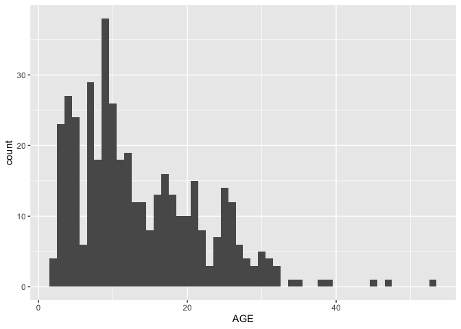
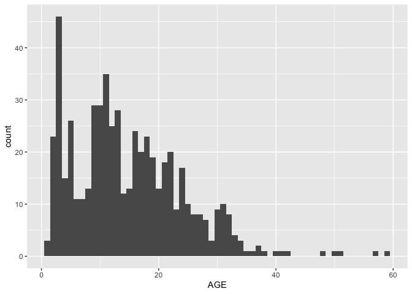
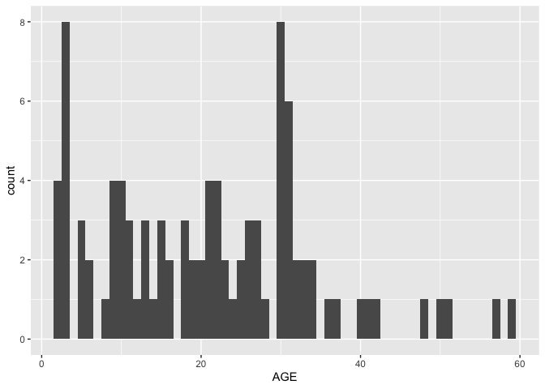

metadata
================
diana baetscher
2025-04-14

## Read in existing metadata and organize

Some samples have been extracted and have ABLG numbers, others do not
and have no unique keys.

``` r
library(tidyverse)
```

    ## ── Attaching core tidyverse packages ──────────────────────── tidyverse 2.0.0 ──
    ## ✔ dplyr     1.1.4     ✔ readr     2.1.4
    ## ✔ forcats   1.0.0     ✔ stringr   1.5.1
    ## ✔ ggplot2   3.5.1     ✔ tibble    3.2.1
    ## ✔ lubridate 1.9.3     ✔ tidyr     1.3.1
    ## ✔ purrr     1.0.2     
    ## ── Conflicts ────────────────────────────────────────── tidyverse_conflicts() ──
    ## ✖ dplyr::filter() masks stats::filter()
    ## ✖ dplyr::lag()    masks stats::lag()
    ## ℹ Use the conflicted package (<http://conflicted.r-lib.org/>) to force all conflicts to become errors

``` r
library(readxl)
```

``` r
adult_coll <- read_xlsx("../data/POP_epigenetic_metadata/POPAdultCollections1719.xlsx")
```

    ## New names:
    ## • `` -> `...14`
    ## • `` -> `...15`
    ## • `` -> `...16`
    ## • `` -> `...17`
    ## • `` -> `...18`
    ## • `` -> `...19`

``` r
# are vial numbers unique?
adult_coll %>%
  filter(!is.na(AGE)) 
```

    ## # A tibble: 417 × 19
    ##    Region  Year   Vial LENGTH WEIGHT   SEX   AGE START_LATITUDE START_LONGITUDE
    ##    <chr>  <dbl>  <dbl>  <dbl>  <dbl> <dbl> <dbl>          <dbl>           <dbl>
    ##  1 GOA     2017 307699    300    342     2     6           59.3           -147.
    ##  2 GOA     2017 310698    280    272     2     6           59.3           -147.
    ##  3 GOA     2017 313697    320    458     2     8           59.3           -147.
    ##  4 GOA     2017 316696    380    696     2    13           59.3           -147.
    ##  5 GOA     2017 319695    290    336     2     7           59.3           -147.
    ##  6 GOA     2017 322694    380    684     2    12           59.3           -147.
    ##  7 GOA     2017 325693    360    618     2    12           59.3           -147.
    ##  8 GOA     2017 328692    350    598     2     8           59.3           -147.
    ##  9 GOA     2017 331691    400    768     2    11           59.3           -147.
    ## 10 GOA     2017 334690    420    978     2    29           59.3           -147.
    ## # ℹ 407 more rows
    ## # ℹ 10 more variables: GEAR_TEMPERATURE <dbl>, SURFACE_TEMPERATURE <dbl>,
    ## #   BOTTOM_DEPTH <dbl>, Notes <chr>, ...14 <chr>, ...15 <chr>, ...16 <dbl>,
    ## #   ...17 <chr>, ...18 <chr>, ...19 <chr>

``` r
# all of the samples with ages are from 2017 in this batch.
```

439 vials and 570 NA rows.

``` r
adult_coll %>%
  filter(!is.na(AGE)) %>%
  ggplot(aes(x = AGE)) +
  geom_histogram(binwidth = 1)
```

<!-- -->

Let’s assume the 2019 sample ages are in other of the other data sheets:

``` r
spec_2019 <- read_xlsx("../data/POP_epigenetic_metadata/MASELKO_GOA_2019_seastorm_pop specimen.xlsx")

spec_2019 %>%
  filter(!is.na(AGE)) %>% # 565 samples with AGE info
  ggplot(aes(x = AGE)) +
  geom_histogram(binwidth = 1)
```

<!-- -->

``` r
# how many samples older than 30 yrs?
spec_2019 %>%
  filter(AGE > 40)
```

    ## # A tibble: 7 × 9
    ##   CRUISE VESSEL  HAUL SPECIES_CODE SPECIMENID   SEX LENGTH WEIGHT   AGE
    ##    <dbl>  <dbl> <dbl>        <dbl>      <dbl> <dbl>  <dbl>  <dbl> <dbl>
    ## 1 201901    143    12        30060         34     1    430   1214    50
    ## 2 201901    143    13        30060         39     1    390    745    57
    ## 3 201901    143    14        30060         45     1    460   1218    48
    ## 4 201901    143   125        30060        225     2    500   1679    51
    ## 5 201901    143   240        30060        451     2    450   1082    41
    ## 6 201901    143   267        30060        539     1    390    740    59
    ## 7 201901    143   287        30060        618     2    470   1436    42

38 samples with ages \> 30 yrs 7 samples \> 40 yrs

``` r
# set seed because of random sampling
set.seed(549)

age_selected <- spec_2019 %>%
  filter(AGE < 40) %>%
  mutate(age_grp = ifelse(AGE < 10, 1, NA)) %>%
  mutate(age_grp = ifelse(AGE > 9 & AGE < 20, 10, age_grp)) %>%
  mutate(age_grp = ifelse(AGE > 19 & AGE < 30, 20, age_grp)) %>%
  mutate(age_grp = ifelse(AGE > 29 & AGE < 40, 30, age_grp)) %>%
  group_by(age_grp) %>%
  sample_n(22, replace = F)
```

``` r
# just the oldest fish
selected_sample <- spec_2019 %>%
  filter(AGE > 39) %>% # plus the age-sampled fish
  bind_rows(age_selected)

# histogram of 96 samples
selected_sample %>%
  ggplot(aes(x = AGE)) +
  geom_histogram(binwidth = 1)
```

<!-- -->

``` r
selected_sample %>%
  write_csv("csv_outputs/POP_selected_epigenetic_samples_20250414.csv")
```
